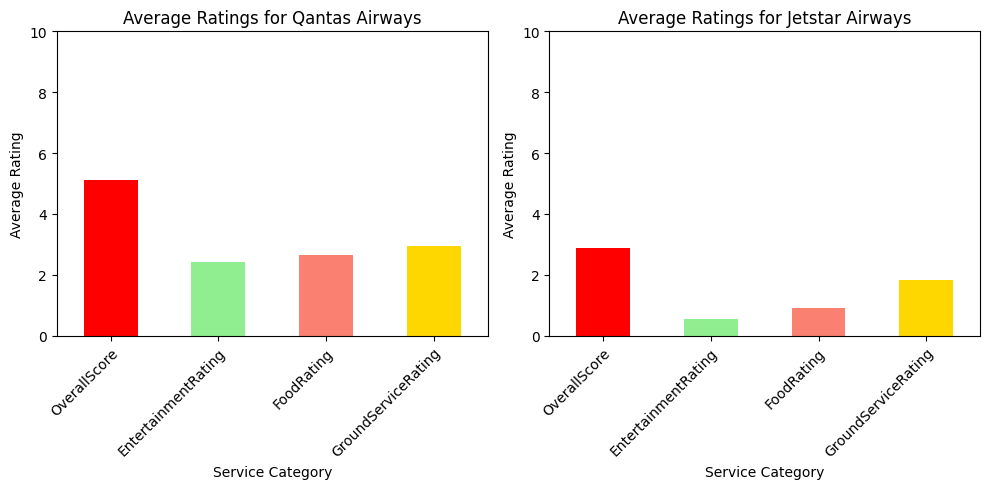
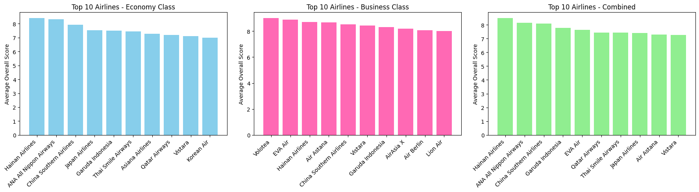
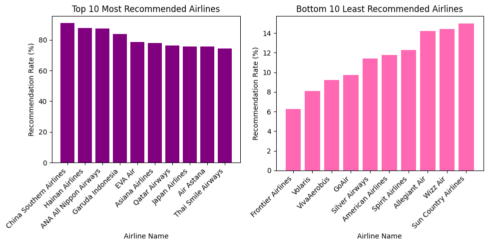
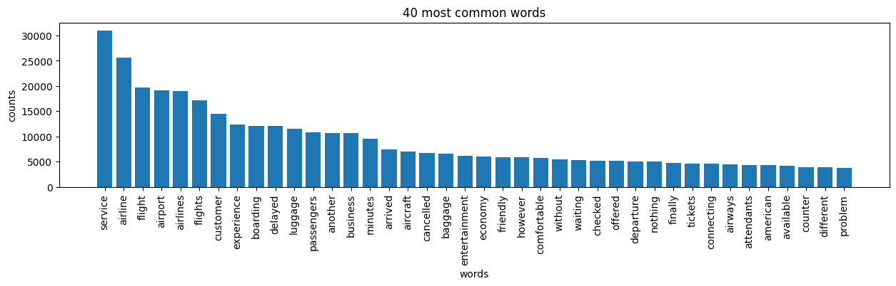
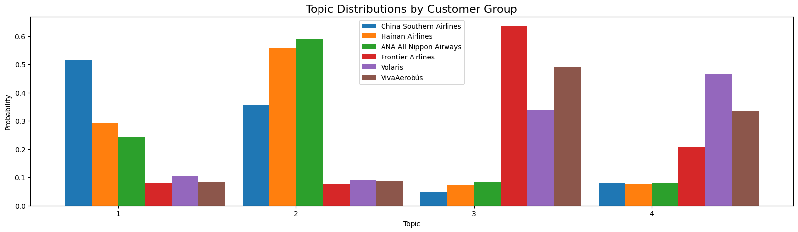

# Airline Customer Experience & Sentiment Analytics

Python analysis of 50,000 airline passenger reviews, built for a hypothetical client engagement: an established Australian airline wanting to understand how it stacks up against global competitors on service quality, sentiment and passenger priorities. Combines rating benchmarking, VADER sentiment analysis and LDA topic modelling.

## Where the client stands

**Neither Qantas nor Jetstar ranks in the top 10 for overall or category-specific performance, in any cabin class.** The gap to the benchmark is large and consistent across every service dimension measured:

  

- **Qantas**: OverallScore ~5.1, with Entertainment, Food and Ground Service all between 2.4 and 3.0.
- **Jetstar**: OverallScore below 3, with Entertainment and Food near or below 1.
- Top-tier airlines typically score above 8 overall, with service-specific ratings of 4-5+.

Neither airline appears in the top 10 or bottom 10 for recommendation rate either, sitting in a mid-table "neither loved nor hated" zone, which is arguably a bigger strategic risk than being an outright bottom performer.

## Who's setting the benchmark

  

Hainan Airlines led the Combined ranking, followed by ANA All Nippon Airways and China Southern Airlines, consistent across Economy and Business class breakdowns. Sentiment analysis reinforces the same ordering: Hainan scored the highest average sentiment (0.79), ahead of China Southern (0.73) and ANA (0.70).

  

## What passengers actually talk about

Across all 50,000 reviews, the most frequent terms cluster around service, flight logistics and delays, before any airline-specific comparison is applied:

  

Topic modelling (LDA, 4 topics, selected by coherence score) resolved this into four themes:

1. **Boarding process** (~18% of content): punctuality, check-in efficiency, gate coordination.
2. **In-flight experience** (~29%): comfort, entertainment, crew friendliness.
3. **Operational disruption** (~29%): delays, cancellations, connections.
4. **Luggage & booking** (~24%): baggage handling, ticketing, website experience.

**The split between top-rated and bottom-rated airlines is stark:**

  

For China Southern, Hainan and ANA, over half of review content falls into Topics 1-2 (boarding and in-flight experience); these passengers are refining an already-solid experience. For Frontier, Volaris and VivaAerobus, Topic 3 (delays and disruption) dominates (Frontier alone sits above 60%), meaning these passengers are reacting to service failures, not commenting on comfort.

## Recommendations

1. **Prioritise in-flight experience investment** (seat comfort, entertainment, crew): the single strongest differentiator between top and mid-tier performers.
2. **Target operational reliability and communication during disruptions**: the dominant driver of negative sentiment for lower-rated carriers, and the area where Qantas/Jetstar risk sliding further.
3. **Upgrade digital booking and baggage tracking**: the other recurring source of complaints identified in topic modelling.
4. **Build a continuous feedback loop** using sentiment and topic tracking, rather than one-off benchmarking, so shifts in passenger priority are caught early.

## Methodology

- Cleaned and prepared 50,000 reviews; benchmarked overall and category ratings by airline and cabin class
- VADER sentiment analysis on review text, including a targeted pass on reviews mentioning "service/services"
- Text cleaning, stop-word removal and term-document matrix construction ahead of topic modelling
- LDA topic model via Gensim, with topic count selected by coherence score testing
- Compared topic distributions between top-3 and bottom-3 rated airlines to link passenger concerns to rating outcomes

## Tools & techniques

`Python` `Pandas` `NumPy` `Matplotlib` `Seaborn` `NLTK (VADER)` `Gensim (LDA)` `scikit-learn` `Sentiment Analysis` `Topic Modelling` `Exploratory Data Analysis`

## Repository contents

- [`airline-customer-experience-analytics.ipynb`](airline-customer-experience-analytics.ipynb): full notebook, data prep, benchmarking, sentiment analysis and topic modelling, with all code and outputs
- `images/`: charts referenced above

---

